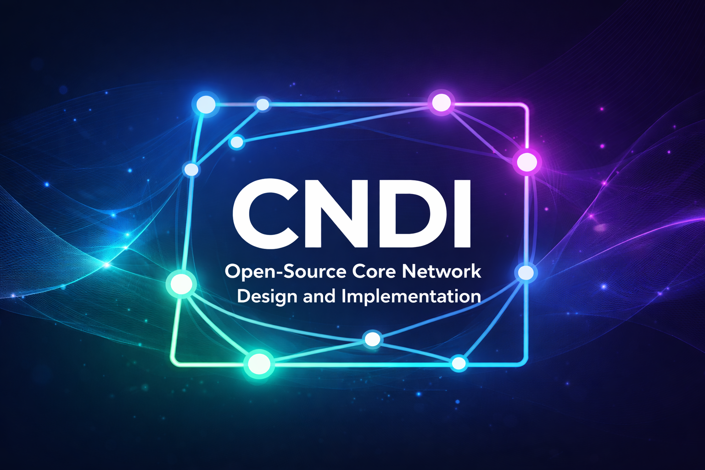

# cndi-free5gc

## 課程簡介

本課程以培養 5G 行動通訊人才為目標。核心網路在 5G 通訊網路中扮演著不可或缺的角色，開發網路元件需要具備豐富的領域知識（SDN / Network Programming / OS...）。本課程除了**涵蓋前面提到的知識**以外，更會以淺入深出帶領學生體驗核心網路的開發與知識。

本課程將以 [free5GC](https://free5gc.org) 開源軟體為主體，此軟體為陳志成教授領導開發的核心網路開源軟體，是全世界第一個開源的 5G 核心網路專案，並於 2024 年 9 月 16 日加入全球開源軟體領導組織 — Linux 基金會，為 5G 網路的研究與發展帶來強大的平台與資源

## 課程目標

1. 了解什麼是 5G
2. 成為 5G 開源專案的貢獻者，包含 5G Core / 5G RAN...
3. 成為 free5GC 的[貢獻者](https://github.com/free5gc/governance/blob/main/CONTRIBUTORS.md)

## 課程大綱 & 進度

| 週 | 日期 | 主題 | 事件 |
| - | - | - | - |
| 1 | 2026-09-07 | Syllabus | PT1 |
| 2 | 2026-09-14 | Github, git and dev tool introduction | FPJ |
| 3 | 2026-09-21 | 4G to 5G | **PT1 DDL** & PJ1 |
| 4 | 2026-09-28 | ==教師節放假== | |
| 5 | 2026-10-05 | 5G Architecture | |
| 6 | 2026-10-12 | 5GC Network Functions AMF/SMF/UPF | **PJ1 DDL** & PT2 |
| 7 | 2026-10-19 | 5GC Network Functions Other NFs | PJ2 |
| 8 | 2026-10-26 | ==光復節放假== | **PT2 DDL** |
| 9 | 2026-11-02 | 5GC Deployment - free5GC Compose | Midterm & PT3 |
| 10 | 2026-11-09 | 5GC Deployment - free5GC Helm | **PJ2 DDL** |
| 11 | 2026-11-16 | 5G RAN/UE - free-ran-ue | **PT3 DDL** & PJ3 |
| 12 | 2026-11-23 | 5G RAN/UE - Concurrent Programming | |
| 13 | 2026-11-30 | 5G RAN/Ue - Unit / Integration Test | **FPJP DDL** |
| 14 | 2026-12-07 | Final Project Discussion | **PJ3 DDL** |
| 15 | 2026-12-14 | Final Project Demo | **FPJ DDL** |
| 16 | 2026-12-21 | Final Project Demo | |

> [!Note]
>
> - PT：Pratice
> - PJ：Project
> - FP：Final Project
> - FPJP：Final Project Proposal
> - DDL：Deadline

## 參考教材

1. [5G 核心網輕鬆學：free5GC 與 RAN/UE 模擬器](https://free-ran-ue.github.io/doc-5g-core-book/zh/)
2. [5G Mobile Core Network: Design, Deployment, Automation, and Testing Strategies](https://www.tenlong.com.tw/products/9781484264720)
3. [EN 帶你入門 5G 核心網路](https://www.books.com.tw/products/0010970849?srsltid=AfmBOooPp8AyGCq4LX8M9ByPcjcSVHvmUsl8Q_N4xIW7C4j_dphDs7Y4)

> [!Note]
>
> - 參考教材 1 可以直接在網頁看，開放抖內（也算是貢獻者之一？）
> - 參考教材 2 可以在交大圖書館借閱、或是透過圖書館系統下載電子版，不需要購買。
> - 參考教材 3 可以在交大圖書館借閱，不需要購買。

## 背景知識

- OS
- Network/Socket Programming
- Concurrent Programming
- Golang

## 評分 & 作業

- （15%）Project 1 - free5GC CTF, `2026-09-21 ~ 2026-10-12`
- （15%）Project 2 - Network Service Function, `2026-10-19 ~ 2026-11-19`
- （20%）Project 3 - NR Dual Connection, `2026-11-16 ~ 2026-12-07`
- （40%）Final Project 4 - 5Gix

    - (10%) Proposal - Final Project Plan, `2026-09-14 ~ 2026-11-30`

- （10%）Participation - Midterm & Practices

    - Midterm 必須參加，不開放補考或是提前考
    - Practice 不是 1 個 1% 計算，會是 Participation 調整依據

        - Practice 1, Installation, `2026-09-07 ~ 2026-09-21`
        - Practice 2, , `2026-10-12 ~ 2026-11-09`
        - Practice 3, ULCL & Traffic Influence, `2026-11-02 ~ 2026-11-16`

## 注意事項

- 作業基本上都是 Go 語言開發，請大家開始自學！有問題先問 AI 再來找助教或是找我，但我不一定有時間回
- 完全不點名，要來不來都行，但是這些是 30e 啊！
- 作業有問題可以問助教，但不是助教幫你寫，也不是幫你 debug
- 真的有貢獻 PR 到 5G 開源專案並被 Merged 的可以加分，但不是 1:1
- **嚴禁抄襲**，如果發現抄襲，抄的人與被抄的人學期成績都會有**嚴重**的懲處
- **嚴禁缺繳**，如果有缺繳，直接當掉（敷衍或是空白視同缺繳）

    - Midterm / Practice 不適用此規則

- 補繳規則：

    - Practice：不接受任何理由遲交
    - Project：*70%/week

        - 2個禮拜就是 70%*70%=49%
        - 遲交1秒也是遲交，不接受理由（網路卡住、重新上傳但來不及、我有 commit 記錄、我在飛機上飛機誤點、我的時區不一樣）

    - Final Project（含 Proposal）：不接受任何理由遲交

- Email 統一用 e3 站內信，其他不保證回
